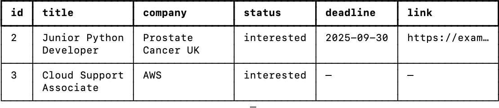

# Job Application Tracker (Python CLI)

A simple command-line tool to keep track of job applications. You can add jobs, update their status, search, and export everything to a CSV file.

## Features
- Add jobs with title, company, link, deadline, and notes
- List all jobs (with optional filtering by status)
- Update a job’s status (interested, applied, interview, offer, rejected)
- View details for a single job
- Delete jobs
- Search by keyword
- Export all jobs to CSV


## Getting Started

Create a virtual environment and install dependencies:

```bash
python3 -m venv .venv
source .venv/bin/activate   # Windows: .venv\Scripts\activate
python3 -m pip install -r requirements.txt
